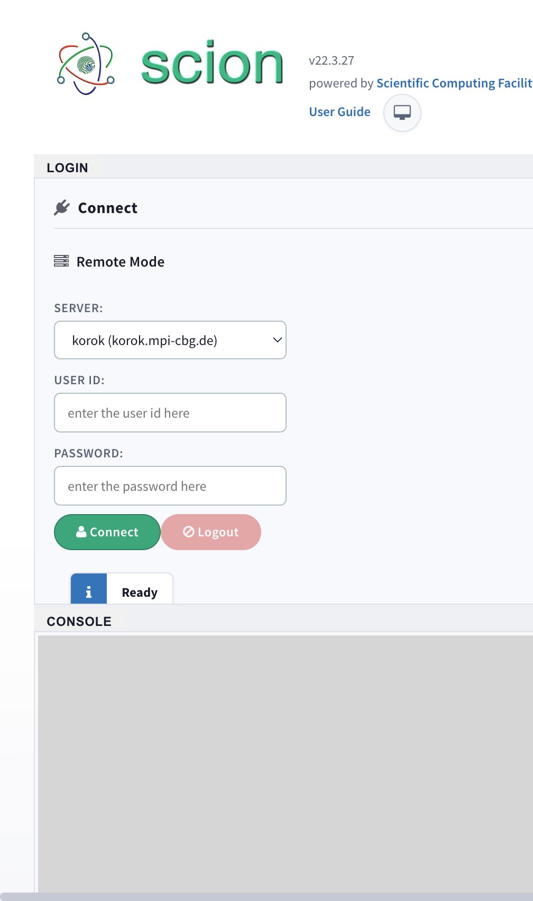
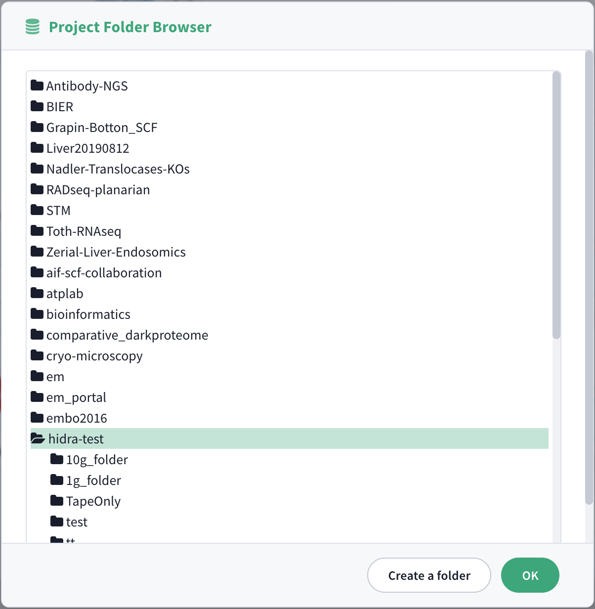
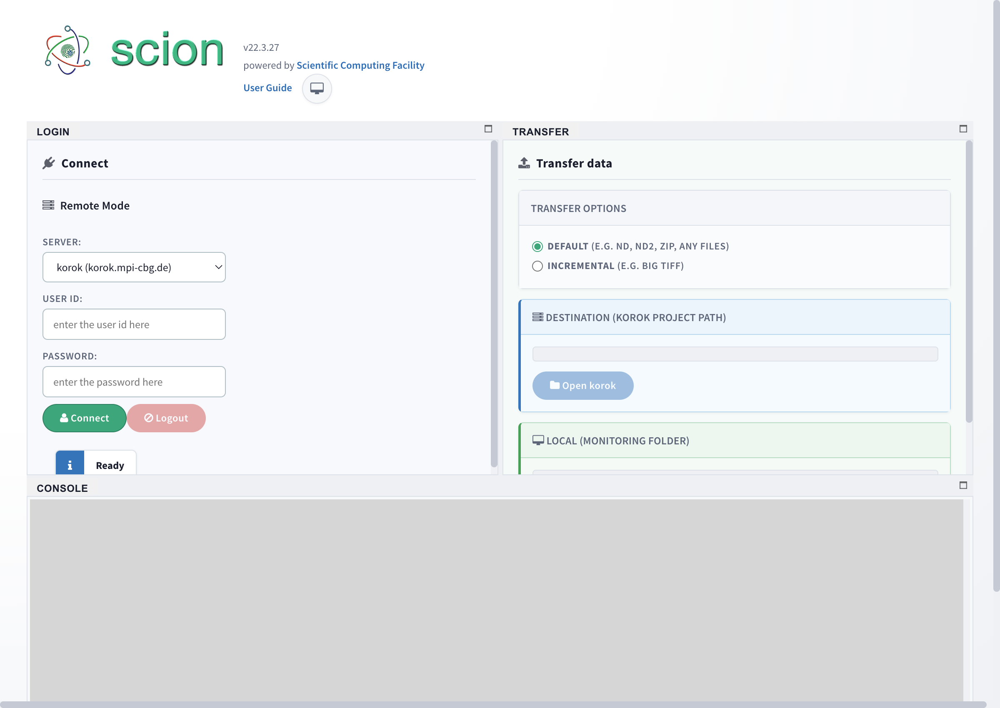
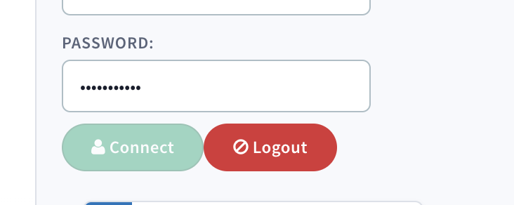

### How to use Scion

#### 1. Open scion software
The fileserver path will be shown under Server as fileserver-ssh.mpi-cbg.de.

### 2. Write your credentials to get access to the fileserver
Enter your username and password in the respective boxes and click Connect.

### 3. Specify the folder where you want to automatically transfer your data to
Click on Open Fileserver > Navigate to your destination > Click OK. The path will then appear under Project Path.

### 4. Specify the “Monitoring Folder”
Click on Upload and select the local folder from which folder you want to transfer data automatically to the Project Path. Once you select the Monitoring Folder, the data transfer will start right away.

### 5. Don’t forget to log out at the end of your session

