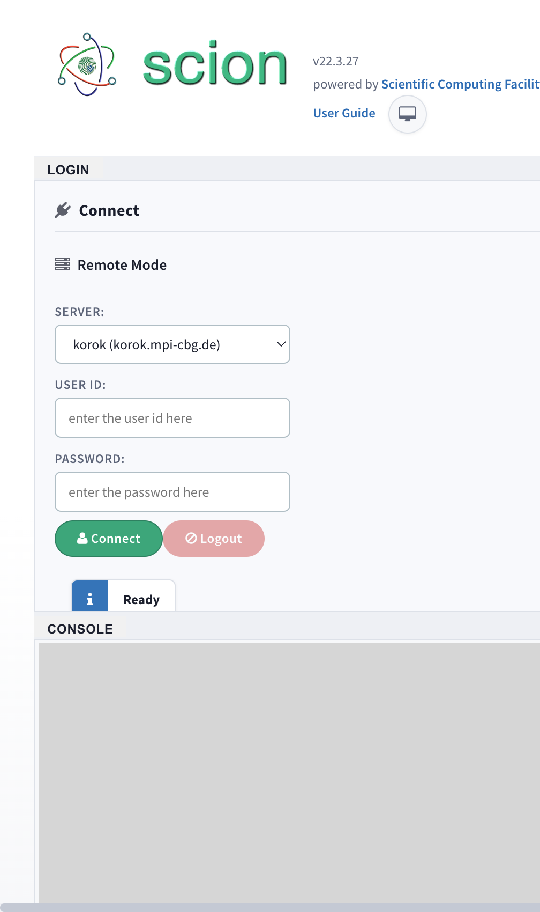
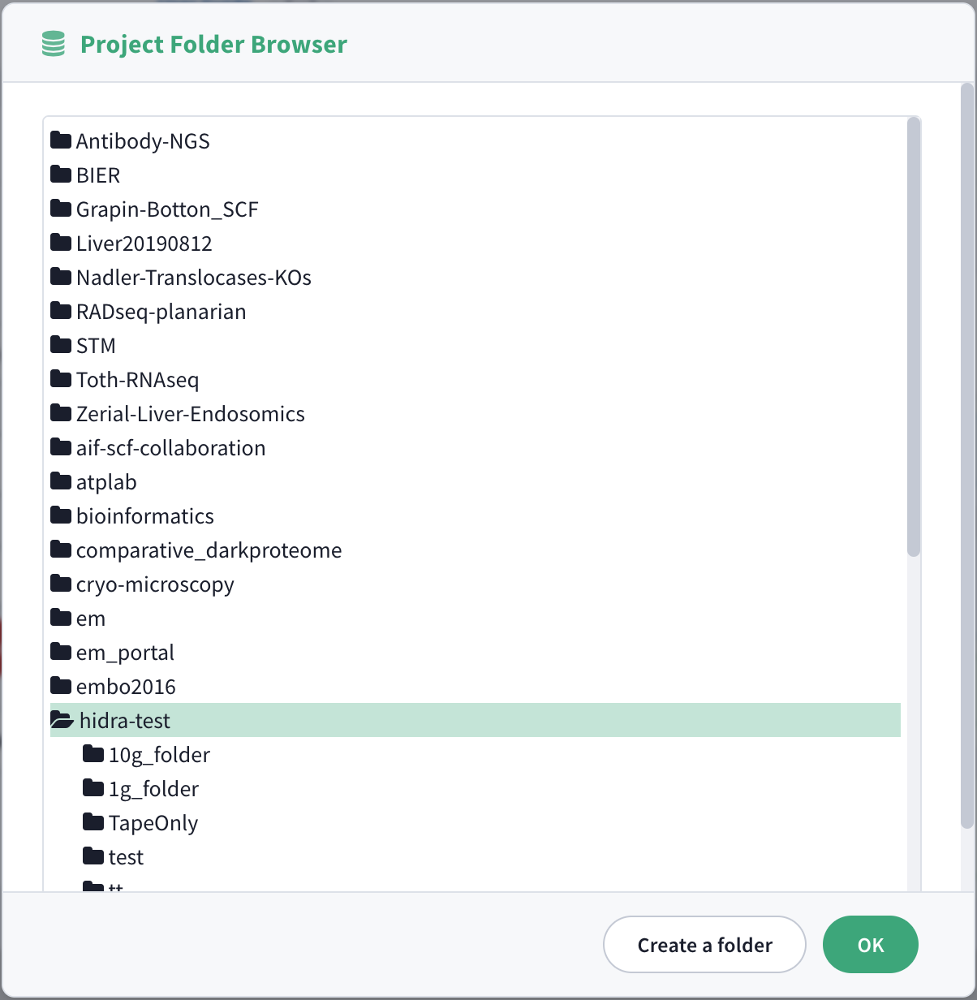
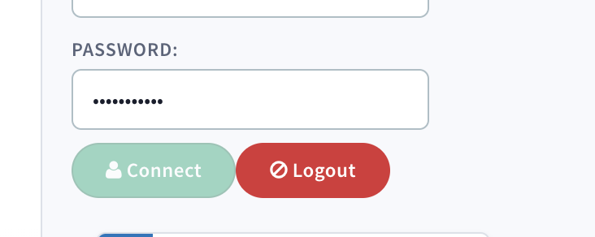
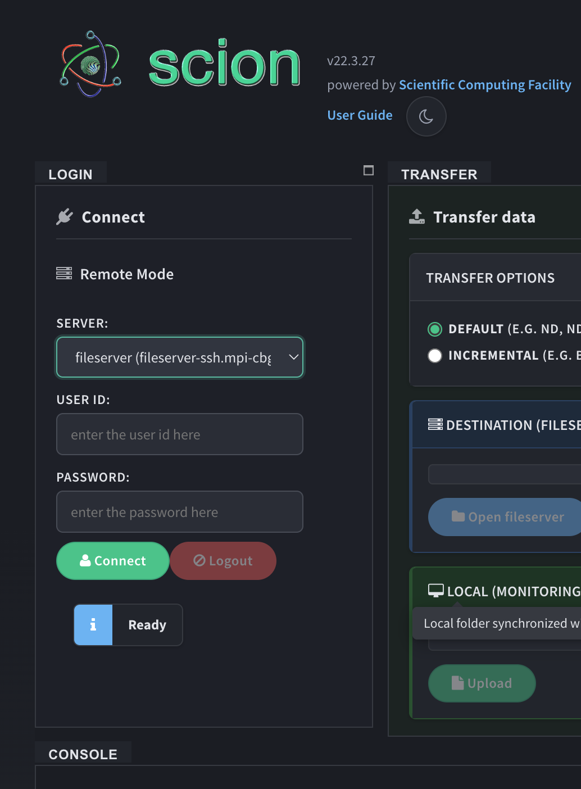

## How to use Scion

### 1. Open scion software
Select the server you want to connect to from the **Server** dropdown. Available servers are:
- **fileserver** (`fileserver-ssh.mpi-cbg.de`)
- **korok** (`korok.mpi-cbg.de`)

The dropdown is disabled once you are connected, so choose your server before clicking **Connect**.

### 2. Write your credentials to get access to the fileserver
Enter your **username** and **password** in the respective boxes and click **Connect** (or press **Enter** in the password field).

### 3. Specify the folder where you want to automatically transfer your data to
Click on **Open Fileserver** > Navigate to your destination > Click **OK**. The path will then appear under **Project Path:**.

### 4. Specify the "Monitoring Folder"
Click on **Upload** and select the local folder from which folder you want to transfer data automatically to the **Project Path**. Also, you can drag and drop the folder in **Upload** button from the **Explorer**. Once you select the **Monitoring Folder**, the data transfer will start right away.

### 5. Stop a transfer
If you need to stop an ongoing transfer, click the **Stop transfer** button (red, appears during active transfer). The rsync process will be terminated immediately.

### 6. Don't forget to log out at the end of your session

##### Note: all the data in the Monitoring Folder will be transferred automatically to the Project Path, except the _temp folder which is created by CellSens.

### 7. Switch between light and dark mode
Click the **theme toggle button** in the header bar (next to the version info) to cycle through:
- **System** (desktop icon) — follows your OS light/dark preference
- **Light** (sun icon) — always light
- **Dark** (moon icon) — always dark

Your choice is saved automatically and restored on next launch.

**Light mode:**

**Dark mode:**

