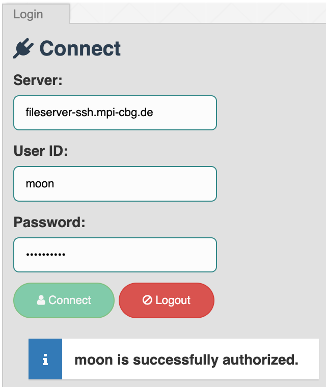
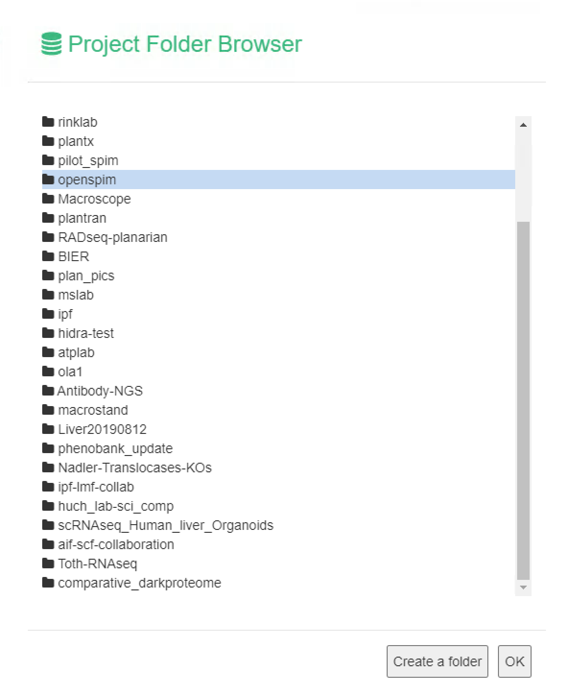
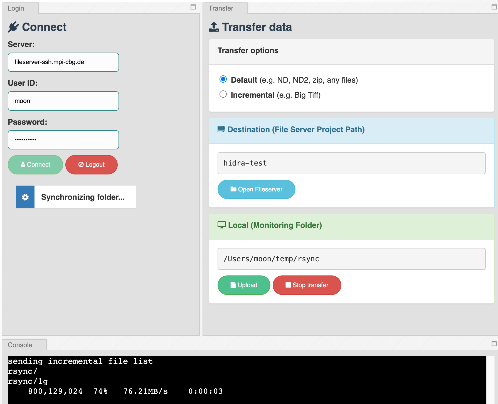

## How to use Scion

### 1. Open scion software
The fileserver path will be shown under **Server** as *fileserver-ssh.mpi-cbg.de*.

### 2. Write your credentials to get access to the fileserver
Enter your **username** and **password** in the respective boxes and click **Connect**.

### 3. Specify the folder where you want to automatically transfer your data to
Click on **Open Fileserver** > Navigate to your destination > Click **OK**. The path will then appear under **Project Path:**.

### 4. Specify the “Monitoring Folder”
Click on **Upload** and select the local folder from which folder you want to transfer data automatically to the **Project Path**. Also, you can drag and drop the folder in **Upload** button from the **Explorer**. Once you select the **Monitoring Folder**, the data transfer will start right away.

### 5. "Stop transfer"
You can stop transfer during synchronizing the folder at any time. Please open the folder with **Upload** or drag-and-drop the folder **Upload** button if you want to upload/monitor the acquisition folder.

### 6. Don’t forget to log out at the end of your session

##### Note: all the data in the Monitoring Folder will be transferred automatically to the Project Path, except the _temp folder which is created by CellSens.
