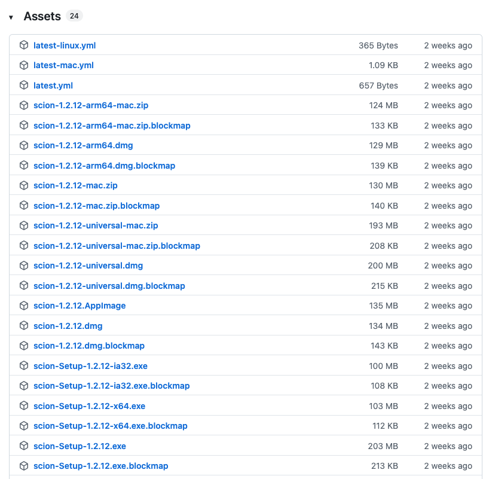
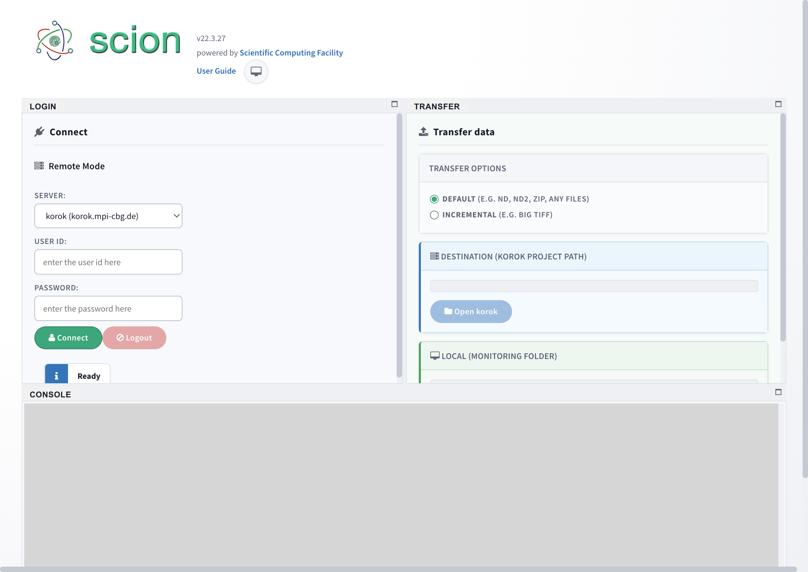
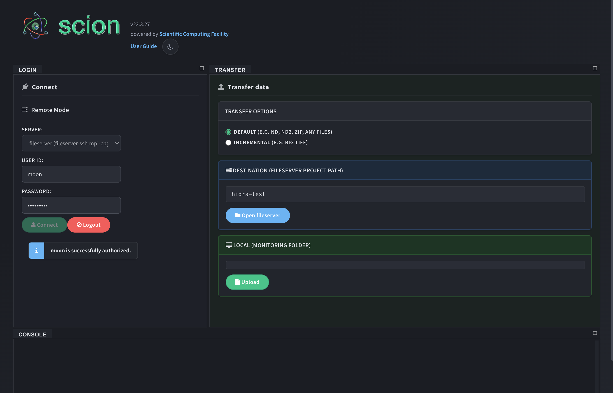

Scion
=======

Scion is a file transfer tool based on electron user interface backed by ```rsync``` runtime. You can install the binary version from **releases** section.

## Getting started

**Scion** can be used in Windows, Linux and MacOSX. To get started, check out [how to use scion](howto.md) and [the installation instructions in the documentation](setup.md) for development.

### Requirements

macOS 10.11+, Windows 7+, or Linux (Ubuntu 14.04+, Fedora 24+, Debian 8+).

`rsync` version 3.0.0 or higher is required (pre-installed on macOS and most Linux distributions).

### Installation

To install the software, please, visit our facility project repository, [https://github.com/mpicbg-scicomp/scion](https://github.com/mpicbg-scicomp/scion).

There is the [releases section](https://github.com/mpicbg-scicomp/scion/releases) in the [github repository](https://github.com/mpicbg-scicomp/scion). Each version contains multiple assets because Scion supports Windows (>= Windows 7), Linux (>= Ubuntu 14.04, Fedora 24, Debian 8) and MacOSX (>= 10.11).

* Windows: Download **scion-Setup-x.x.x.exe**
* Linux: Download **scion-x.x.x.AppImage**
* Mac: Download **scion-x.x.x.dmg**



### Screenshots

**Light mode:**



**Dark mode:**



## Usage examples

Scion can be used for any kinds of data transfer projects.

You can find a [list of real-world examples](examples.md) in the documentation.

## Help and Support

We are always happy to help out with your use-cases or any other questions you might have. You can ask a question via email, scicomp@mpi-cbg.de or signal an issue on [GitHub](https://github.com/mpicbg-scicomp/scion/).

## Features

* File transfer over rsync
* Fail-safe transfer with stop/resume capability
* Multi-user support
* Multi-server support (select the target server at login)
* Realtime monitoring of source folder
* Automatic re-synchronization when folder content changes
* Transfer resume per server (unfinished transfers are tracked per server and prompted on next login)
* Dark mode with system, light, and dark theme options (persisted across sessions)
* Enter key to connect from the password field

## Contributions

We welcome contributions. If you want to contribute to this project, please read our [Dev](dev.md) documentation first.

## Licensing

Scion is licensed under the BSD 3-Clause "New" or "Revised" License. See [LICENSE](LICENSE) for the full license text.
