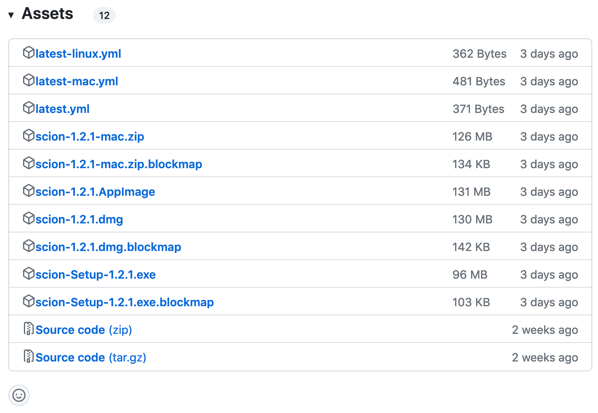

Scion
=======

Scion is a file transfer tool based on electron user interface backed by ```rsync``` runtime. You can install the binary version from **releases** section.

## Getting started

**Scion** can be used in Windows, Linux and MacOSX. To get started, check out [how to use scion](howto.md) and [the installation instructions in the documentation](setup.md) for development.

### Requirements

MacOSX from 10.11.x, Windows 7 and Linux (Ubuntu, Fedora, Debian).

In case of Linux and MacOSX, the higher version than 3.0.0 `rsync` should be installed.

### Intallation

To install the software, please, visit our facility project repository, [https://github.com/mpicbg-scicomp/scion](https://github.com/mpicbg-scicomp/scion).

There is the [releases section](https://github.com/mpicbg-scicomp/scion/releases) in the [github repository](https://github.com/mpicbg-scicomp/scion). Each version contains multiple assets because Scion supports Windows (>= Windows 7), Linux (>= Ubuntu 14.04, Fedora 24, Debian 8) and MacOSX (>= 10.11).

* Windows: Download **scion-Setup-x.x.x.exe**
* Linux: Download **scion-x.x.x.AppImage**
* Mac: Download **scion-x.x.x.dmg**



## Usage examples

Scion can be used for any kinds of data transfer projects. 

You can find a [list of real-world examples](examples.md) in the documentation.

## Help and Support

We are always happy to help out with your use-cases or any other questions you might have. You can ask a question via email, scicomp@mpi-cbg.de or signal an issue on [GitHub](https://github.com/mpicbg-scicomp/scion/).

## Features

* File transfer over rsync
* Fail-safe transfer
* Multi-user support
* Realtime monitoring source folder
* Synchronization folder if the content is changed

## Contributions

We are looking forward to contributions. If you want to contribute this project, please read our [Dev](dev.md) documentation first.

## Licensing

Scion is licensed under the BSD 3-Clause "New" or "Revised" License. See [LICENSE](LICENSE) for the full license text.
