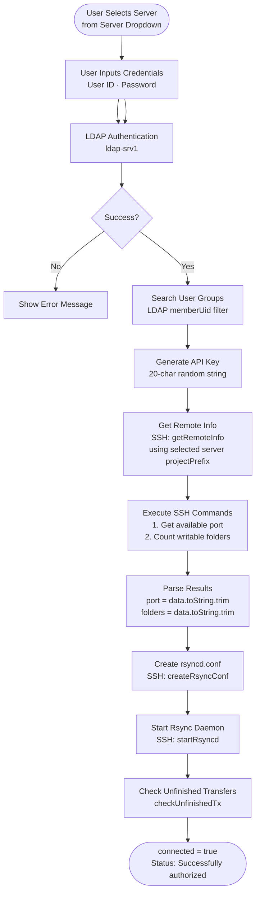
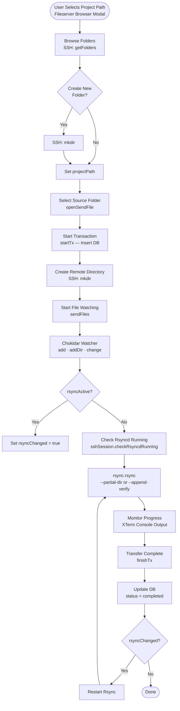
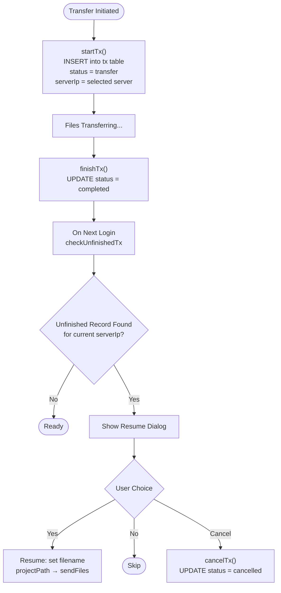
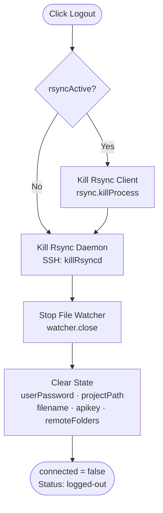
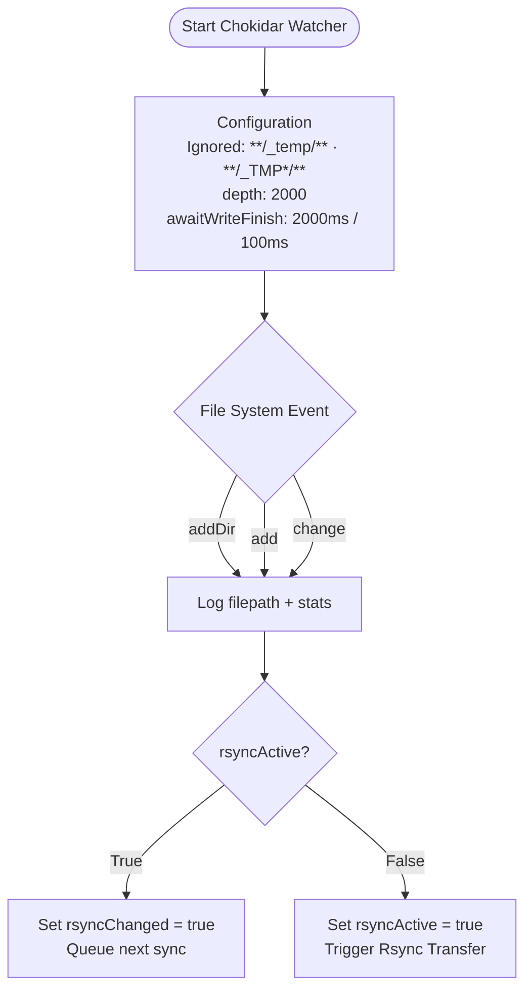
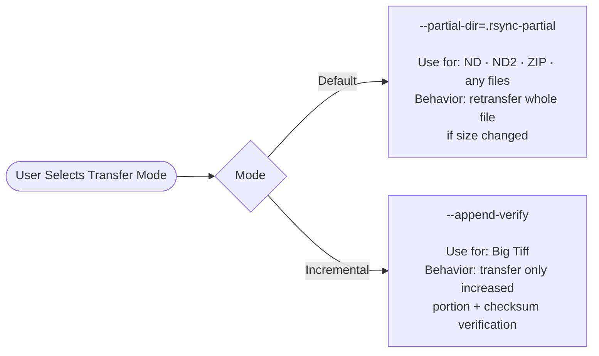
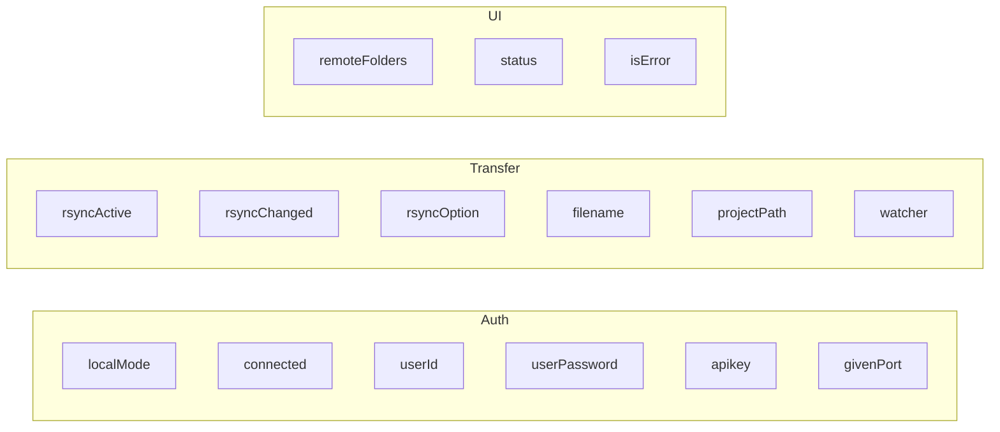
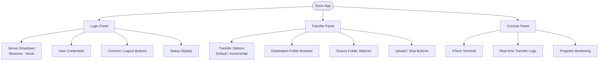
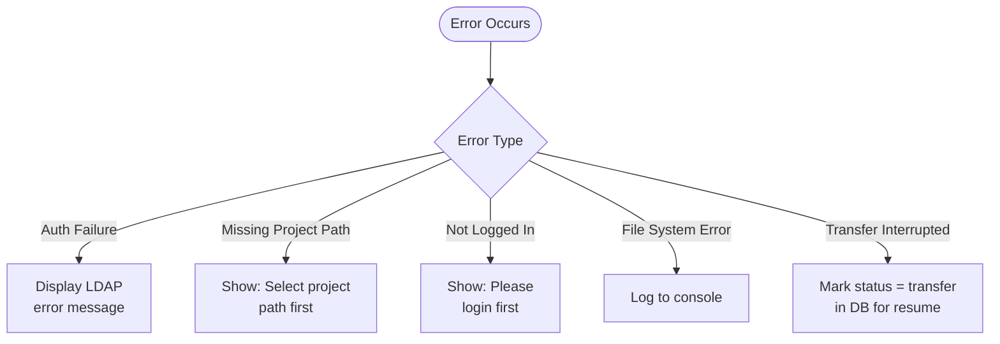

# Scion Pipeline Diagram

## Overview
This document describes the data flow and process pipelines in the Scion application based on LandingPage.vue.

---

## Main Process Flows

### 1. Remote Mode Authentication Pipeline

---

### 2. Remote File Transfer Pipeline

---

### 3. Transaction Management Flow

---

### 4. Logout Process

---

### 5. File Watching Details

---

### 6. Rsync Transfer Options

---

## Key Components Integration

### Database (tx.db)
- **Table**: `tx` (transactions)
- **Fields**: id, encPass, src, dest, status, created, updated, serverIp
- **Statuses**: `transfer`, `completed`, `cancelled`
- **Purpose**: Track transfer sessions per server and enable resume functionality
- **Multi-server**: Each transaction row stores the `serverIp` it belongs to. `checkUnfinishedTx` only prompts for rows matching the currently selected server.
- **Migration**: On first run after upgrade, the `serverIp` column is added via `ALTER TABLE`. Existing rows are backfilled to `fileserver-ssh.mpi-cbg.de`.

### SSH Session Module
- **Functions**:
  - `mkdir()` — Create remote directories
  - `getFolders()` — List remote folders
  - `checkRsyncdRunning()` — Verify rsync daemon status
  - `getRemoteAvailablePort()` — Get available port for rsyncd
  - `createRsyncConf()` — Configure rsync daemon
  - `startRsyncd()` — Start rsync daemon on server
  - `killRsyncd()` — Stop rsync daemon

### Rsync Module
- **Functions**:
  - `rsync()` — Remote file transfer
  - `rsyncLocal()` — Local file transfer
  - `killProcess()` — Stop active transfer
  - `rsyncVersion()` — Check rsync version

### LDAP Authentication
- **Server**: ldap-srv1
- **Base DN**: `dc=ldap-srv1,dc=mpi-cbg,dc=de`
- **User DN**: `cn={user},cn=users,dc=ldap-srv1,dc=mpi-cbg,dc=de`
- **Group Search**: `cn=groups,dc=ldap-srv1,dc=mpi-cbg,dc=de`
- **Filter**: `(memberUid={user})`

---

## State Management

### Key Reactive Variables

---

## User Interface Panels

---

## Error Handling

